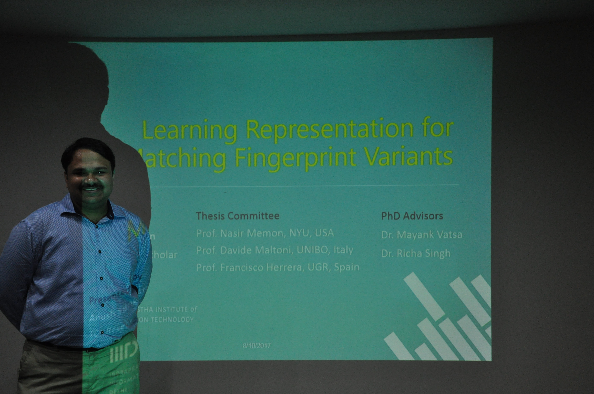

## PhD Thesis

On this August (10th) occasion, I defended my seven-year-long PhD thesis titled, "**Learning Representations for Matching Fingerprint Variants**" (I should probably write a seperate thesis explaining the process and the previous names considered, before arriving at this title!). 

The defense was chaired by some of the most revered and accomplished professors in this domain,
1. [Prof. Davide Maltoni](https://www.unibo.it/sitoweb/davide.maltoni/en), UNIBO
2. [Prof. Francisco Herrera](http://decsai.ugr.es/~herrera/), UGR
3. [Prof. Nasir Memon](http://engineering.nyu.edu/people/nasir-memon), NYU 

along with my thesis advisors,
1. [Dr. Mayank Vatsa](https://www.iiitd.edu.in/~mayank/), IIIT Delhi
2. [Dr. Richa Singh](https://www.iiitd.edu.in/~richa/), IIIT Delhi

## Thesis and Slides

> Digitical copy of the thesis from IIIT Delhi Library [Link](https://repository.iiitd.edu.in/xmlui/handle/123456789/512)

> Learning Representations for Matching Fingerprint Variants [PDF](../docs/Thesis_Anush_1.pdf)

> Slide Deck [PPT](../docs/Thesis_slides_v2.pptx)

## Video of the talk

> [PhD Defense](https://youtu.be/D0OjXnmlbp0)

## Captured Moments

## Journal Publications

1. **A. Sankaran**, A. Majumdar, M. Vatsa, and R. Singh, Group Sparse Autoencoder, Image and Vision Computing, Special Issue on Regularization Techniques for High-Dimensional Data Analysis, Elsevier, vol. 60, pp. 64-74, 2017. **Impact Factor: 2.671**
3. **A. Sankaran**, A. Jain, T. Vashisth, M. Vatsa, and R. Singh, Adaptive latent fingerprint segmentation using feature selection and random decision forest classification, Information Fusion, Elsevier, vol. 34, pp. 1-15, 2017. **Impact Factor: 5.667**
4. **A. Sankaran**, G. Goswami, M. Vatsa, R. Singh, and A. Majumdar, Class Sparsity Signature based Restricted Boltzmann Machines, Pattern Recognition, Special Issue on Deep Image Video, Elsevier, vol. 61, pp. 674-685, 2017. **Impact Factor: 4.582**
5. A. Sankaran, M. Vatsa, R. Singh, Multisensor Optical and Latent Fingerprint Database, IEEE Access, vol. 3, pp. 653 - 665, 2015. Impact Factor: 3.244
6. A. Sankaran, M. Vatsa, R. Singh, Latent Fingerprint Matching: A Survey, IEEE Access, vol. 2, pp. 982-1004, 2014. (_Appeared as one of the top-10 highly viewed publication of 2014_). **Impact Factor: 3.244**

## Book Chapters
1. **A. Sankaran**, A. Malhotra, M. Vatsa, and R. Singh, Learning Representations for Uncontrolled Fingerprint Recognition, Deep Learning in Biometrics, CRC Press, 2017 (In Press).

## Peer-reviewed Conferences
1. A. Taneja, A. Tayal, A. Malhotra, **A. Sankaran**, M. Vatsa, and R. Singh, Fingerphoto Spoofing in Mobile Devices: A Preliminary Study, International Conference on Biometrics: Theory, Applications and Systems, pp. 1-7, 2016.
2. **A. Sankaran**, A. Agarwal, R. Keshari, S. Ghosh, A. Sharma, M. Vatsa, and R. Singh, Latent Fingerprint from Multiple Surfaces: Database and Quality Analysis, International Conference on Biometrics: Theory, Applications and Systems, pp. 1-6, 2015.
3. **A. Sankaran**, P. Pandey, M. Vatsa, R. Singh, On Latent Fingerprint Minutiae Extraction using Stacked Denoising Sparse AutoEncoders, International Joint Conference on Biometrics, 2014, pp. 1-7, (**Best Poster Award**).
4. **A. Sankaran**, M. Vatsa, R. Singh, Automated Clarity and Quality Assessment for Latent Fingerprints: A Preliminary Study, International Conference on Biometrics: Theory, Applications and Systems, pp. 1-6, 2013 (**Best Poster Award**).
5. **A. Sankaran**, M. Vatsa, R. Singh, Hierarchical Fusion for Matching Simultaneous Latent Fingerprint, International Conference on Biometrics: Theory, Applications and Systems, pp. 377-382, 2012.
6. **A. Sankaran**, T.I. Dhamecha, M. Vatsa, R. Singh, On Matching Latent to Latent Fingerprints,International Joint Conference on Biometrics, pp. 1-6, 2011.
